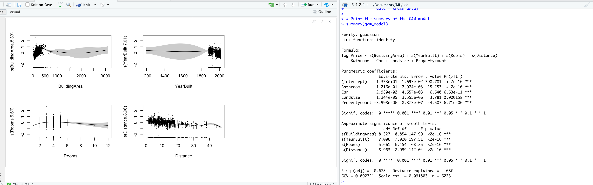

```{r setup, include=FALSE}
knitr::opts_chunk$set(warning = FALSE, message = FALSE)

```

### Introduction
Welcome to this  marketing analysis using the Melbourne dataset from Kaggle! In this study, we will employ various statistical models and machine learning techniques to gain valuable insights and make predictions in the field of marketing. 

We were captivated by the fascinating world of real estate, recognizing its abundance of opportunities and possibilities. Exploring the Melbourne housing dataset became our gateway to valuable knowledge that transcended geographical boundaries, allowing us to grasp the broader dynamics of the real estate market.

Although there are other datasets, the dataset of Melbourne has limited variables which are just enough for our analysis. One other reason for our choice is due to  its cosmopolitan appeal and thriving economy, which become a popular destination for property buyers and investors from all over the world. We saw the Melbourne housing dataset as a unique window into this dynamic market, providing insights that could be applied to real estate endeavors in various locations.

Our thirst for knowledge drove us to delve deep into the dataset, meticulously analyzing its wealth of information on as property size, location, number of rooms, and sale prices. We hoped to extract meaningful conclusions and predictions about the real estate market as a whole by using statistical models and machine learning techniques.

Our curiosity led us to discover hidden patterns and correlations within the dataset, allowing us to identify factors influencing property values, understand buyer preferences, and detect emerging trends that crossed geographical boundaries. We realized that, regardless of our physical location, the Melbourne housing dataset provided a golden opportunity to gain a deep understanding of the real estate market.

In conclusion, our exploration of the Melbourne housing dataset provided us with valuable information about the real estate market that extended far beyond Melbourne itself. 

#### Project's objective
The main objectives of this marketing analysis are as follows:

Explore the Melbourne dataset to understand the relationships between various marketing-related factors and real estate prices.
Develop predictive models using statistical and machine learning techniques to estimate property sale prices accurately.
Optimize marketing strategies by leveraging the insights derived from the models to maximize marketing outcomes..
Provide actionable recommendations to businesses on how to enhance their marketing efforts based on the analysis results.

#### Our Client
The client for this analysis is a real estate marketing agency operating in Melbourne. They are seeking data-driven insights to optimize their marketing strategies and improve their business performance. By understanding the factors that impact real estate prices and being able to predict property sale prices accurately, the client can make informed decisions on pricing, targeting, and positioning their properties in the market. The analysis aims to provide the client with actionable recommendations to enhance their marketing efforts and achieve better outcomes.

#### Our dataset 

The Melbourne dataset used in this analysis contains information about real estate sales in Melbourne, Australia. It includes a variety of features that can influence property prices, such as property size, location, number of rooms, and other relevant attributes. The dataset consists of the following columns:

Rooms: Number of rooms in the property
Type: Type of the property (e.g., house, unit, townhouse)
Price: Sale price of the property (target variable)
Method: Method of sale (e.g., auction, private treaty)
SellerG: Real estate agent
Date: Date of sale
Distance: Distance from CBD (Central Business District) in kilometers
Postcode: Postal code
Bedroom2: Number of bedrooms (alternative to Rooms for some properties)
Bathroom: Number of bathrooms
Car: Number of car spaces
Landsize: Land size in square meters
BuildingArea: Building area in square meters
YearBuilt: Year the property was built
CouncilArea: Local government area
Regionname: General region (e.g., Northern Metropolitan, Western Metropolitan)
Propertycount: Number of properties in the suburb
Address: Property address
The dataset provides a rich set of features that can be used to predict property sale prices accurately and derive insights for marketing optimization.

#### Data Preprocessing
###### Compiled by Maha Hazime_Zayour
Data preprocessing is an important step in preparing a dataset for analysis and modeling. In this R Markdown section, we will focus on the data preprocessing steps performed on the "housing_data" dataset. The code provided demonstrates the necessary actions to clean and transform the data.


```{r Packages, include=FALSE}
# Libraries
library(dplyr)
library(mice)
library(caret)
library(tidyverse)
library(ggplot2)
library(visdat)
library(gridExtra)
library(corrplot)
library(mgcv)
library(stringr)
library(e1071)
library(caret)
library(neuralnet)
```

#### Loading and cleaning the Data
```{r Loading and cleaning data, include=FALSE, results='hide'}
# Load the dataset
housing_data <- read.csv("Melbourne_housing_FULL.csv")

#  Display the structure of the dataset-
str(housing_data)

# Summary statistics of the dataset
summary(housing_data)

# Variable names
names(housing_data)

# Convert a character column to a factor
housing_data$Suburb <- as.factor(housing_data$Suburb)
housing_data$Type <- as.factor(housing_data$Type)
housing_data$Method <- as.factor(housing_data$Method)
housing_data$Regionname <- as.factor(housing_data$Regionname)

# Convert Distance and Propertycount to numeric
housing_data$Distance <- as.numeric(housing_data$Distance)
housing_data$Propertycount <- as.numeric(housing_data$Propertycount)

# Cleaning the dataset

# Check for missing values
sum(is.na(housing_data))

# Check for missing values in each column
missing_columns <- colSums(is.na(housing_data)) > 0
names(housing_data)[missing_columns]

# Create and display a missing value plot
missing_plot <- vis_miss(housing_data)
print(missing_plot)

# Drop rows with missing data
housing_data <- na.omit(housing_data)

# Drop unnecessary columns
housing_data <- housing_data %>%
  select(-SellerG, -CouncilArea, -Address, -Postcode)


# Detect and handel outliers 

# Calculate summary statistics for BuildingArea
summary(housing_data$BuildingArea)

# Calculate the lower and upper bounds for outliers using IQR
Q1 <- quantile(housing_data$BuildingArea, 0.25)
Q3 <- quantile(housing_data$BuildingArea, 0.75)
IQR <- Q3 - Q1
lower_bound <- Q1 - 1.5 * IQR
upper_bound <- Q3 + 1.5 * IQR


# Remove outliers from the BuildingArea
cleaned_data <- housing_data[housing_data$BuildingArea >= lower_bound & housing_data$BuildingArea <= upper_bound, ]

# Check summary statistics of BuildingArea in the cleaned dataset
summary(cleaned_data$BuildingArea)

# Check for zero values in the BuildingArea column
sum(housing_data$BuildingArea == 0, na.rm = TRUE)

# Calculate the mean of non-zero BuildingArea values
building_area_mean <- mean(housing_data$BuildingArea[housing_data$BuildingArea != 0], na.rm = TRUE)

# Replace zero values in BuildingArea with the mean
housing_data$BuildingArea[housing_data$BuildingArea == 0] <- building_area_mean

```
#### Graphical Analysis
###### Compiled by Maha Hazime_Zayour
After preparing the data, a graphical analysis is conducted to provide a visual exploration of the dataset. This step allows us to inspect the data, identify any potential errors, and gain a deeper understanding of its structure. By visualizing the data through various charts, plots, and graphs, we can identify patterns, trends, outliers, and other notable features that may impact our analysis. This graphical analysis serves as a valuable tool in identifying potential data issues, such as missing values, inconsistencies, or outliers. Additionally, it helps us understand the characteristics and distribution of the variables in the dataset, enabling us to make informed decisions regarding data preprocessing and modeling techniques. Overall, the graphical analysis provides valuable insights that can guide the subsequent steps of our analysis.

```{r Graphical analysis of data, include=FALSE}

#Histogram of Price:
ggplot(housing_data, aes(x = Price)) +
  geom_histogram(bins = 30, fill = "blue", color = "white") +
  labs(x = "Price", y = "Frequency", title = "Distribution of Price")

# View the "Regionname" column before abbreviating
head(housing_data$Regionname)

# Abbreviate Regionnames
housing_data$Regionname <- str_replace_all(housing_data$Regionname, c('Northern Metropolitan'='N Metro',
                                                                      'Western Metropolitan'='W Metro', 
                                                                      'Southern Metropolitan'='S Metro', 
                                                                      'Eastern Metropolitan'='E Metro', 
                                                                      'South-Eastern Metropolitan'= 'SE Metro', 
                                                                      'Northern Victoria'='N Vic',
                                                                      'Eastern Victoria'='E Vic',
                                                                      'Western Victoria'='W Vic'))

# Boxplot of Price by Region:
ggplot(housing_data, aes(x = Regionname, y = Price)) +
  geom_boxplot(fill = "lightblue") +
  labs(x = "Regionname", y = "Price", title = "Price Variation by Region")

# Set the theme
theme_set(theme_minimal())


# Create the subplots
p1 <- ggplot(data = housing_data, aes(x = Type, y = Price)) +
  geom_boxplot() +
  labs(x = "Type", y = "Price") +
  ggtitle("Type v Price")

p2 <- ggplot(data = housing_data, aes(x = Method, y = Price)) +
  geom_boxplot() +
  labs(x = "Method", y = "Price") +
  ggtitle("Method v Price")

p3 <- ggplot(data = housing_data, aes(x = Regionname, y = Price)) +
  geom_boxplot() +
  labs(x = "Regionname", y = "Price") +
  ggtitle("Region Name v Price")

# Arrange the subplots in a grid
grid.arrange(p1, p2, p3, ncol = 2, nrow = 2)


# Graphical analysis (Numeric Features)

# Set the theme
theme_set(theme_minimal())

# Create the subplots
p1 <- ggplot(data = housing_data, aes(x = Rooms, y = Price)) +
  geom_point(color = "blue") +
  xlab("Rooms") +
  ylab("Price") +
  ggtitle("Rooms v Price")

p2 <- ggplot(data = housing_data, aes(x = Distance, y = Price)) +
  geom_point(color = "blue") +
  xlab("Distance") +
  ylab("Price") +
  ggtitle("Distance v Price")+
  scale_x_continuous(breaks = seq(0, max(housing_data$Distance), 10))

p3 <- ggplot(data = housing_data, aes(x = Bathroom, y = Price)) +
  geom_point(color = "blue") +
  xlab("Bathroom") +
  ylab("Price") +
  ggtitle("Bathroom v Price")

p4 <- ggplot(data = housing_data, aes(x = Car, y = Price)) +
  geom_point(color = "blue") +
  xlab("Car") +
  ylab("Price") +
  ggtitle("Car v Price")

p5 <- ggplot(data = housing_data, aes(x = Landsize, y = Price)) +
  geom_point(color = "blue") +
  xlab("Landsize") +
  ylab("Price") +
  ggtitle("Landsize v Price")

p6 <- ggplot(data = housing_data, aes(x = BuildingArea, y = Price)) +
  geom_point(color = "blue") +
  xlab("BuildingArea") +
  ylab("Price") +
  ggtitle("BuildingArea v Price")

p7 <- ggplot(data = housing_data, aes(x = YearBuilt, y = Price)) +
  geom_point(color = "blue") +
  xlab("YearBuilt") +
  ylab("Price") +
  ggtitle("YearBuilt v Price") +
  scale_x_continuous(breaks = seq(1850, 2020, by = 10), labels = seq(1850, 2020, by = 10),expand = c(0.02, 0))

p8 <- ggplot(data = housing_data, aes(x = Propertycount, y = Price)) +
  geom_point(color = "blue") +
  xlab("Propertycount") +
  ylab("Price") +
  ggtitle("Propertycount v Price")+ 
  scale_x_continuous(breaks = seq(0, max(housing_data$Distance), 5000))

# Arrange the subplots in a grid
grid.arrange(p1, p2, p3, p4, p5, p6, p7, p8, ncol = 2, nrow = 4)


# correlation
# Select numeric columns from the housing_data dataset
numeric_columns <- sapply(housing_data, is.numeric)
numeric_data <- housing_data[, numeric_columns]

# Calculate the correlation matrix
correlation <- cor(numeric_data)

# Create the correlation map
corrplot(correlation, method = "color", type = "upper", 
         tl.col = "black", tl.srt = 45, addCoef.col = "black",
         diag = FALSE)


```

The insights drawn from this graphical analysis are as follows,From the histogram we have noticed that the distribution is right skewed, which means the most of the houses which are sold are in range between 1000000 to 2000000. Intrestingly the houses with more than 5 are considerbly samre price as the 5 room house or even cheaper. We think this might be the outliers or the houses that are far from city or abonded. Similarly some other valueable insights are drawn from these grpahichal analysis and research questions are formed to answer in this paper.

Our research questions are as follows:
1.How can the value of a home be determined based on factors such as distance, number of bedrooms, number of rooms, type of property, and land size? Based on these criteria are used by real estate agents and clients give a predict price of house?

2. Considering my financial capability, which geographical area (south, east, west, or north) would be affordable for me to buy a house in?

3. Among different types of properties, which type is currently being sold the most in the real estate market?

4. Which suburbs are considered the best options for purchasing a property? 

5. In which part of town are the properties generally more expensive? 

6. What are the recommended locations for buying a 2-bedroom unit?

To answer these research questions, we applied various models on the datasets like Linear model, Genaralised Linear Model with family set to Poisson for categorical and with family set to Bionomial for amount, Generalised Additive model, Artificial neural networks, Support Vector Machine, and at last we solved an optimization problem for few of the research questions. 

## Linear Model
###### Compiled by Maha Hazime_Zayour
Our analysis will encompass a range of statistical and machine learning models. We will begin by constructing a Linear Model, which is a fundamental technique used to establish relationships between predictor variables and the response variable. This model will provide us with a baseline understanding of the dataset and the linear relationships between variables.

To predict house prices using a linear model, the first step is to split the data into training and testing sets. In this analysis, a seed value of 123 was chosen for reproducibility purposes. The dataset was divided using an 80-20 split, where 80% of the observations were assigned to the training data and 20% were assigned to the testing data.
```{r}
# Split the data into training and testing sets
set.seed(123)  # Set a seed for reproducibility
train_indices <- createDataPartition(housing_data$Price, p = 0.8, list = FALSE)
train_data <- housing_data[train_indices, ]
test_data <- housing_data[-train_indices, ]
```

```{r Linear Model}
# Fit a simple linear model
lm_housing <- lm(Price ~ BuildingArea, data = train_data)

# coefficient Regression
coef(lm_housing)

# Summary
summary(lm_housing)

# visualise Simple Regression
ggplot(train_data, aes(x = BuildingArea, y = Price)) +
  geom_point() +
  geom_smooth(method = "lm", se = FALSE) +
  labs(x = "Building Area", y = "Price", title = "Price vs. Building Area") +
  scale_x_continuous(limits = c(0, 800))
```

In the simple regression model (lm_housing) fitted to the data, the intercept is estimated to be 506,748.62 dollars , which is an unrealistic predicted average housing price when the BuildingArea is zero. The coefficient for BuildingArea suggests that, on average, each unit increase in BuildingArea is associated with a $3923.24 increase in the predicted housing price. The p-values for both the intercept and BuildingArea coefficient are highly significant, indicating a strong relationship between BuildingArea and housing prices. The model explains approximately 25.94% of the variance in housing prices (moderate explanatory power), with a residual standard error of around 584,500 dollars. Therefore, the model suggests that larger building areas have a significant impact on higher housing prices, but its predictive power is relatively modest.

#### Multiple linear regression without interaction
After considering the limited predictive power of the initial linear model, we have expanded the analysis by incorporating additional variables into a multiple linear regression. This enables us to account for the potential influence of other factors on housing prices and improve the model's predictive performance.

```{r}
# Fit multiple linear regression model
lm_housing.2 <- lm(Price ~ BuildingArea + YearBuilt, data = train_data)

# Summary
summary(lm_housing.2)

# Coefficients
coef(lm_housing.2)

# Create scatter plot for BuildingArea
plot_building_area <- ggplot(train_data, aes(x = BuildingArea, y = Price)) +
  geom_point() +
  geom_smooth(method = "lm", se = FALSE) +
  labs(x = "Building Area", y = "Price", title = "Price vs. Building Area")

# Create scatter plot for YearBuilt
plot_year_built <- ggplot(train_data, aes(x = YearBuilt, y = Price)) +
  geom_point() +
  geom_smooth(method = "lm", se = FALSE) +
  labs(x = "Year Built", y = "Price", title = "Price vs. Year Built") +
  scale_x_continuous(limits = c(1850, 2016))

# Combine the plots
combined_plots <- grid.arrange(plot_building_area, plot_year_built, nrow = 1)

# Display the combined plot
print(combined_plots)
```
The multiple linear regression model incorporating BuildingArea and YearBuilt as predictors shows significant relationships with housing prices. The model suggests that larger building areas are associated with higher prices, while older buildings tend to have lower prices, holding other factors constant. The model explains approximately 37.44% of the housing price variance, indicating a moderate level of predictive power. The residual standard error suggests an average difference of around $537,300 between observed and predicted values. Considering the model's performance, it is recommended to also explore additional predictors or refine the model further to improve its accuracy and explanatory power.

#### Multiple linear regression with interaction
```{r}
# Fit multiple linear regression model with interaction
lm_housing.3 <- lm(Price ~ BuildingArea * YearBuilt, data = train_data)
summary(lm_housing.3)

```
Comparing the models without and with the interaction term, we conclude that the model with the interaction term provides additional information and captures a more complex relationship between BuildingArea, YearBuilt, and housing prices. While the improvement in R-squared is relatively small, it suggests that considering the interaction effect can enhance the model's explanatory power. However, the impact on the overall predictive performance of the model may not be substantial, as indicated by the modest improvement in R-squared.

#### Multiple linear regression including multiple predictors

Now we added additional variables to capture a more comprehensive understanding of the relationship between the predictors and housing prices. This will allow us to assess their individual impacts while controlling for the effects of other variables.
```{r}
# Fit multiple linear regression model

lm_housing.4 <- lm(Price ~ BuildingArea +  YearBuilt + Rooms + Distance + Bathroom + Car + Landsize +  Propertycount, data = train_data)

# coefficient Regression
coef(lm_housing.4)

# Summary
summary(lm_housing.4)
```
```{r echo=FALSE}
# Create scatter plots with regression line for each predictor variable
scatter_plots <- lapply(names(lm_housing.4$model)[-1], function(var) {
  ggplot(lm_housing.4$model, aes_string(x = var, y = "Price")) +
    geom_point() +
    geom_smooth(method = "lm", se = FALSE, color = "blue") +
    xlab(var) +
    ylab("Price")
})

# Arrange the scatter plots in a grid layout
grid_plot <- do.call(gridExtra::grid.arrange, scatter_plots)

# Display the grid of scatter plots
print(grid_plot)
```

The multiple linear regression model performed well in explaining the variation in housing prices in Melbourne. The included predictor variables, such as BuildingArea, YearBuilt, Rooms, Distance, Bathroom, Car, Landsize, and Propertycount, had significant impacts on housing prices. The model's adjusted R-squared value of 0.5247 suggests that approximately 52.47% of the housing price variance can be accounted for by these variables. The estimated coefficients provided insights into the relationships: building area and the number of rooms positively influenced prices, while ageof the building, distance from the CBD, and property count had negative effects. The p-values indicated strong evidence to reject the null hypothesis of no relationship. However, it is important to acknowledge that there may be additional factors not considered in the model that contribute to housing price variability.

#### Measures of fit
At this stage of the analysis, we proceed to compare the R-squared values of the various models to assess the goodness of fit. By examining the R-squared values, we can gain insight into how well each model explains the variability in the data and measures the extent to which the independent variables account for the variation in the dependent variable.
```{r}
# Calculate R-squared (to comment on the goodness of the fit ) 
# model with no interaction 
formula(lm_housing.2)
summary(lm_housing.2)$r.squared

formula(lm_housing.4)
summary(lm_housing.4)$r.squared

# model with interaction 
formula(lm_housing.3)
summary(lm_housing.3)$r.squared


# Calculate adjusted R-squared
summary(lm_housing.2)$adj.r.squared
summary(lm_housing.3)$adj.r.squared
summary(lm_housing.4)$adj.r.squared

```
The comparison between the models with and without the interaction term shows a small improvement in the R-squared values, indicating that the inclusion of the interaction term has a minor impact on the overall predictive performance. The adjusted R-squared values also exhibit similar results, suggesting that the inclusion of the interaction term does not significantly enhance the model's ability to explain housing prices. Therefore, it may be concluded that the interaction term does not play a substantial role in predicting housing prices in this context. In contrast, when comparing the model lm_housing.4, which incorporates additional variables (Rooms, Distance, Bathroom, Car, Landsize, Propertycount), it shows higher R-squared (0.5253) and adjusted R-squared (0.5247) values compared to both lm_housing.2 and lm_housing.3. TThese improvements indicate that the additional variables significantly enhance the model's ability to explain the variability in housing prices beyond the BuildingArea and YearBuilt variables. Therefore, lm_housing.4 is recommended as the most suitable model for predicting housing prices in this context.


#### Fitted values & Residuals

#### Fitted values
Next, we will analyze the fitted values for the linear regression model. Fitted values are the predicted values that the model generates for the observations used to train the model. These fitted values are calculated using the estimated regression coefficients obtained from the model. By examining the fitted values, we can assess how well the model predicts the target variable for the training data.
```{r}
# Fitted values
fitted_values <- fitted(lm_housing)

str(fitted_values)
head(fitted_values)
```
The fitted values vector consists of 6223 elements, representing the predicted housing prices for specific observations. Examples of these predicted prices include 816684.5, 1095234.4, 1063848.5, 1330628.7, 926535.1, and 800991.5 for observations 3, 5, 7, 12, 15, and 19, respectively. These fitted values provide a basis for comparison with the actual prices, allowing us to evaluate the model's performance in predicting housing prices.

#### Residuals
Residuals, in the context of a linear model, represent the discrepancies or differences between the observed values and the predicted values obtained from the model

```{r}
residuals <- resid(lm_housing)

length(residuals)
head(residuals)
```
The displayed residuals are associated with specific data points, identified by their index values (e.g., 3, 5, 7, 12, 15, 19). Each value represents the difference between the observed value and the corresponding predicted value for the respective data point in the linear regression model. For example, the first residual of 218315.5 corresponds to the third data point, indicating that the observed value for that data point is 218315.5 units away from the predicted value

```{r}
set.seed(20) ## for reproducibility
id <- sample(x = 1:144, size = 5)
residuals[id]
fitted_values[id]
```
```{r echo=FALSE}
# Residuals plot
plot(Price ~ BuildingArea, data = train_data,
     main = "Model 'lm_housing'",
     col = "lightgray")

abline(lm_housing)

points(Price ~ BuildingArea, data = train_data[id, ],
       col = "red")

segments(x0 = train_data[id, "BuildingArea"], x1 = train_data[id, "BuildingArea"],
         y0 = fitted_values[id], y1 = train_data[id, "Price"],
         col = "blue")
```
Through the scatter plot, we can observe the overall distribution of the data points. The regression line represents the estimated relationship between the variables. The highlighted points, accompanied by the connecting lines, illustrate the residuals associated with those particular data points. This plot aids in understanding how well the regression model fits the data and provides insights into the presence of any patterns or deviations.


```{r}
# Create new data for prediction
new_data <- data.frame(
  BuildingArea = c(120, 200, 250),
  YearBuilt = c(1990, 2005, 2010),
  Rooms = c(3, 4, 5),
  Distance = c(10, 15, 20),
  Bathroom = c(2, 2.5, 3),
  Car = c(1, 2, 2),
  Landsize = c(500, 600, 700),
  Propertycount = c(5000, 6000, 7000))

# Predict using the linear model
predictions <- predict(lm_housing.4, newdata = new_data)
print(predictions)


# Display predictions
plot(Price ~ BuildingArea, 
     data = train_data,
     xlim = c(50, 600),
     ylim = c(900000, 1600000),
     main = "Predicted vs. Observed Prices")
abline(lm_housing)
##
points(x = new_data$BuildingArea,
       y = predictions, 
       col = "purple",
       pch = 19, cex = 1.5)

# Compute prediction confidence intervals
prediction_ci <- predict(lm_housing.4, newdata = new_data, interval = "prediction")

# Display the predictions and confidence intervals
print(data.frame(predictions, prediction_ci))
```

The predicted house prices for the three new data points in Melbourne range from $973,875.2 to $1,421,910.9. 
The confidence intervals computed for each prediction provide an estimation of the likely range in which the true prices could fall. These intervals are relatively wide, indicating a significant level of uncertainty in the model's estimates. This highlights the limitations of the linear model in accurately capturing the intricate variations in house prices solely based on the given features.

Therefore, while the linear model provides initial estimates, it may not fully capture all the factors that influence house prices in Melbourne. To improve the accuracy of predictions, additional features and more advanced modeling techniques will be explored.

## Generalized Additive Models (GAMs)
###### Compiled by Maha Hazime-Zayour

GAM  model may  throw an error within the R-Markdown environment, but it produces the expected results when executed in a normal R file (MGCV 1.8-41). To view the plots generated by this gam model, it is advised to refer to the accompanying R file.


To improve the accuracy of predictions and account for more complex relationships and potential non-linearities, we will explore the use of a Generalized Additive Model (GAM). By introducing a GAM, we aim to enhance the predictive power of the model and provide more accurate estimates of house prices in Melbourne.

```{r}


# Visualize target Price 
hist(train_data$Price, main = "Histogram of Target Price")

# Apply log transformation
train_data$log_Price <- log(train_data$Price)

# After transformation
hist(train_data$log_Price, main = "Histogram of Log-Transformed Target Price")


# # Fit the GAM model
# gam_model <- gam(log_Price  ~ s(BuildingArea) + s(YearBuilt) + s(Rooms) + s(Distance)+ Bathroom + Car + Landsize + Propertycount,
#              data = train_data)
# 
# # Print the summary of the GAM model
# summary(gam_model)
# 
# # Plot the GAM model
# 
# plot(gam_model, residuals = TRUE, pages = 1, shade = TRUE)
```

```{r}

```

The GAM model includes smooth terms for BuildingArea, YearBuilt, Rooms, and Distance, which have high estimated degrees of freedom (edf). These terms are highly significant in the model, as indicated by high F-statistics and small p-values, indicating their substantial contribution to the model's fit.
The model explains approximately 67.8% of the variation in the response variable, as measured by the adjusted R-squared value. This suggests a reasonable level of explanation for the observed data. The Deviance explained value of 68% further supports the model's ability to capture a significant portion of the total deviance in the response variable.
Overall, the model with the smooth terms is effective in capturing complex relationships and explaining a considerable amount of the variability in the response variable.


## Generailsed Linear model with family set to Poisson
###### Compiled by Fiona Ncuti


To help the agent evaluate whether the number of car spots are coherent to other criteria of the property, this model will estimate the number of car spots based on other criterias such as number of room, bathroom or bedroom.

First let's check the distribution of response variable "Car" and the mean and variance of the variable.
```{r}

car<-housing_data$Car
ggplot(housing_data, aes(x = Car)) +
  geom_histogram(alpha=1, fill = "blue", color = "white",binwidth =0.9) +
  labs(x = "Car", y = "Frequency", title = "Distribution of Car spots")

mean(car)
var(car)

continuous <-select_if(housing_data, is.numeric)
summary(continuous)
```

The plot shows a right skewed distribution which is a typical behavior of variable of type "count".
The mean and variance value differ, we can conclude that we have an over/under dispersion
The continuous dataframe for numeric variables help us to have a glimpse of the behavior of the variables. 

For the prediction a GLM quasi poisson model will be implemented.
Only variable with a correlation coefficient above 0.2 will be used.
```{r}
glm.quasi.car <- glm(Car ~ log(Price)+Rooms+Bathroom+Bedroom2+BuildingArea+Distance , data = housing_data,
                     family = "quasipoisson")

# display summary to view results of the model
summary(glm.quasi.car)
```
All variables have an influence on the response variable as p-value is less than 0.05 except for "Rooms" variable.
We observe an underdispersion situation with this dataset since the deviance value 4157 is lower than the number of degree of freedom 8880.
We will create another model that exclude the predictor variable which doesn't have or has less significant influence on the response variable.
```{r}

glm.quasipoisson.car <- glm(Car ~ log(Price)+Bathroom+Bedroom2+BuildingArea+Distance , data = housing_data,
                     family = "quasipoisson")

print(summary(glm.quasipoisson.car))

#For the interpretation of the coefficient estimates, we should exponentiate these values to get the marginal effect since the poisson model uses the log link function to preclude negative values

coef(glm.quasipoisson.car)
exp(coef(glm.quasipoisson.car))

```
The estimated coefficients for the predictor variables can be interpretated as following, assuming that all other variables are kept constant:

- log(Price): For each unit increase in log price meaning the price is multiplied by 10, the number of car spot increases by ~ 13%
- Bathroom: For an additional bathroom, the number of car spot increases by ~ 3% 
- Bedroom: For an additional bedroom, the number of car spot increases by ~ 14% 
- BuildingArea: For an additional square meter of the building area, the number of car spot increases by ~ 0.03% 
- Distance: for each additional km separating the property to the central business district, the number of car spots increases by 1.7%


Now that the model is built, we will evaluate the performance of the model after splitting the dataset into train & test datsets sevarl times To avoid overfitting. 

```{r }

# Loop
set.seed(121)
##
r.squared.simple <- c()
##
for(i in 1:10^2){
  ## 1) prepare data
  
  train_indices <- createDataPartition(housing_data$Price, p = 0.7, list = FALSE)
  train_data <- housing_data[train_indices, ]
  test_data <- housing_data[-train_indices, ]
  ##
  ## quasi poisson model ##
  ##
  ## 2) fit the model with "train" data
  glm.quasi.car <- glm(Car ~ log(Price)+Rooms +Bathroom+Bedroom2+BuildingArea+Distance , data = train_data,
                       family = "quasipoisson")
  ##
  ## 3) make prediction on the test data
  predict.car <- predict(glm.quasi.car, newdata=test_data, type = "response")
  ##
  ## 4) compute R^2
  r.squared.simple[i] <- cor(predict.car, test_data$Car)^2
}

mean(r.squared.simple)

boxplot(r.squared.simple)

test_data.2 <- test_data
test_data.2["Car"] <- round(predict.car, digits = 0)

t1 <- ggplot(data = test_data, aes(x = Price, y = Car)) +
  geom_point(color = "blue")
t2 <- ggplot(data = test_data.2, aes(x = Price, y = Car)) +
  geom_point(color = "red")

# Arrange the subplots in a grid
grid.arrange(t1, t2)

```
To assess the performance of the model , the r-squared value has been used. the value ranged from 14% to 21%.
On the boxplot we can see that the 100 values are not overdispersed but if it was the case it could lead to misinterpreting.

For the building usecase, 22% is good fitting and will be able to guide the agent in his decisions.

## Quasi binomial model 
###### Compiled by Fiona Ncuti

In order to sell property, it has to be classified and also that help to determine the right price based on its type.For this case we are not dealing with continuous variable but categorical variable as response.
Depending on the criterias given by the customer,the agent would like to advise him on the corresponding type.
This classification model could help the agent to make some other decison regarding his staff if we assume that the superviser categorised the person who handle each type of property.

We implement a logistic regression to predict the binary outcome regarding the type of the property.

By exploring data we can see that the dataset is not balanced between each type. We have more houses than townhouse or units. To simplify the question, we merged unit with townhouses in townhouses category

```{r}

housing_data$Type[housing_data$Type == "u"] <- "t"

housing_data$Type.new  <- as.factor(housing_data$Type)


housing_data$Type.new <- droplevels(housing_data$Type.new)
table(housing_data$Type.new)


glm.quasi.type <- glm(Type.new ~ log(Price)+Rooms+Bathroom+Bedroom2+BuildingArea+Distance+Lattitude+Longtitude , data = housing_data, family = 'binomial')

print(summary(glm.quasi.type))

```

All the variables in the above output have turned out to be significant(p values are less than 0.05 for all the variables) except for building area.
We will build another model that exclude the building area predictor that seems to haven't a significant influence on the response variable.

```{r}

glm.quasi2.type <- glm(Type.new ~ log(Price)+Rooms+Bathroom+Bedroom2+Distance+Lattitude+Longtitude , data = housing_data, family = 'binomial')
print(summary(glm.quasi2.type))
coef(glm.quasi2.type)
print(exp(coef(glm.quasi2.type)))

coef.price <- coef(glm.quasi2.type)["log(Price)"]*0.1
print(exp(coef.price))

coef.lat <- coef(glm.quasi2.type)["Lattitude"]*0.01
print(exp(coef.lat))

coef.long <- coef(glm.quasi2.type)["Longtitude"]*0.01
print(exp(coef.long))

print(contrasts(housing_data$Type.new))

```
The estimated coefficients for the predictor variables can be interpretated as following, assuming that all other variables are kept constant: 

-Price : if the log(price) increase by one unit meaning price multiplied by 10, the odds of a property to be a townhouse decreases by 99% making highly obvious that it's a house as they are the most expensive. 

-Rooms : For an additional room, the odds of a property being a townhouse will decrease by ~ 30%.

-Bedroom : For an additional bedroom, the odds of a property being a townhouse will decrease by ~ 40%.

-Distance : As the distance to CBD increases by one unit, the odds of a property being a house group will decrease by 23%.

-Lattitude : For an additional 1/100 unit on the lattitude, the odds of a property being a townhouse will decrease by ~ 10%.

-Longtitude : For an additional 1/100 unit on the longitude, the odds of a property being a townhouse will increase by ~ 8%.


Now that we have a suitable model, we will analyze the outcome and evaluate the probability of having the value townhouse as "t" or house a "h"
For the evaluation of the performance of the model, we use the Matrix confusion as method to compare observed and predicted values.
```{r}
#######prediction
## 1) prepare data

train_indices <- createDataPartition(housing_data$Type.new, p = 0.7, list = FALSE)
train_data_logi <- housing_data[train_indices, ]
test_data_logi <- housing_data[-train_indices, ]

## 2) fit the model with "train" data
glm.quasi2.type <- glm(Type.new ~ log(Price)+Rooms+Bathroom+Bedroom2+Distance+Lattitude+Longtitude , data = train_data_logi, family = 'binomial')

## 3) make prediction on the test data
predict.type <- predict(glm.quasi2.type, newdata=test_data_logi, type = "response")


# Converting from probability to actual output
test_data_logi$pred_type <- ifelse(predict.type >= 0.5, "t", "h")
# Generating the classification table
table_test <- table(test_data_logi$Type.new, test_data_logi$pred_type)
rownames(table_test) <- c("Obs. t","Obs. h")
colnames(table_test) <- c("Pred. t","Pred. h")

table_test

#Evaluate efficiency of the model

efficiency <- sum(diag(table_test))/sum(table_test)
efficiency

```
From Confusion Matrix, the accuracy of our classification model is accurate at 88% based on the efficiency value.

Our model is considered fairly good as the model accuracy is greater than 70%


## Support Vector Machine 
###### Compiled by Vignesh Govindraj (SVM)

In the following we try to answer the research questions through SVM 
```{r Loading and Splitting Data}
dataset <- read.csv("melb_data.csv")
selected_cols <- c("Distance", "Bedroom2", "Rooms", "Type", "Landsize", "Price")
data <- dataset[selected_cols]

# Split the dataset into training and testing sets
set.seed(125)
trainIndex <- sample(1:nrow(dataset), 0.7 * nrow(dataset))
trainData <- data[trainIndex, ]
testData <- data[-trainIndex, ]
```

Q) Considering the financial capability, which geographical area (south, east, west, or north) would be affordable for me to buy a house in?

```{r RSQ2, Vignesh}

# Select the relevant columns

data <- dataset[,c("Price", "Rooms", "Type", "Distance", "Landsize", "Regionname")]

# Split the dataset into training and testing sets
set.seed(125)
trainIndex <- sample(1:nrow(dataset), 0.7 * nrow(dataset))
trainData <- data[trainIndex, ]
testData <- data[-trainIndex, ]

# Create the regression model
regModel <- lm(Price ~ ., data = trainData)

# Make predictions on the test set
predictions <- predict(regModel, newdata = testData)

# Visualize the output
output <- data.frame(ActualPrice = testData$Price, PredictedPrice = predictions, Regionname = testData$Regionname)

ggplot(output, aes(x = Regionname, y = ActualPrice, fill = PredictedPrice)) +
  geom_bar(stat = "identity", position = "dodge") +
  labs(title = "Affordability of Houses by Region") +
  xlab("Region") +
  ylab("Price") +
  theme_bw()
# Calculate regression evaluation metrics
mse <- mean((predictions - testData$Price)^2)
rmse <- sqrt(mse)
mae <- mean(abs(predictions - testData$Price))
r_squared <- 1 - sum((testData$Price - predictions)^2) / sum((testData$Price - mean(testData$Price))^2)

# Print the regression evaluation metrics
cat("Mean Squared Error (MSE):", mse, "\n")
cat("Root Mean Squared Error (RMSE):", rmse, "\n")
cat("Mean Absolute Error (MAE):", mae, "\n")
cat("R-squared:", r_squared, "\n")
```
The relevant columns for analysis are selected from the dataset which includes "Price", "Rooms", "Type", "Distance", "Landsize", and "Regionname". The resulting data is stored in the variable called  `data`.  The dataset is split into training and testing sets, the `set.seed` function ensures reproducibility by setting a random seed value of 125 and dividing in the ratio of 70% for the training dataset, and 30% for the test dataset. 

A regression model is created using the `lm` function (linear regression) and the formula `Price ~ .` specifies that "Price" is the dependent variable and the remaining variables in the training dataset are the independent variables. Predictions are made on the test dataset using the `predict` function, with the trained regression model and the new data as arguments.

The output is prepared for visualization by creating a data frame named `output`. It includes the actual prices from the test set (`testData$Price`), the predicted prices (`predictions`), and the corresponding region names from the test set (`testData$Regionname`).

Conclusion:
From the visualization and output, it is clear that the predicted value of the house in the Southern Metropolitan area is more than in any other area so we concluded that buying the house in the Southern Metropolitan area is more worth while followed by the Northern and Eastern Metropolitan 


Q) Among different types of properties, which type is currently being sold the most in the real estate market?
```{r RSQ3, Vignesh}

# Select the relevant columns
data <- dataset[, c("Type", "Rooms", "Price", "Distance", "Bedroom2")]

# Convert Type to a factor
data$Type <- factor(data$Type)

# Preprocess the data if needed

# Split the dataset into training and testing sets
set.seed(125)
trainIndex <- sample(1:nrow(dataset), 0.7 * nrow(dataset))
trainData <- data[trainIndex, ]
testData <- data[-trainIndex, ]

# Create the SVM classification model
svmModel <- svm(Type ~ ., data = trainData, type = "C-classification")

# Make predictions on the test set
predictions <- predict(svmModel, newdata = testData)

# Evaluate the model
accuracy <- sum(predictions == testData$Type) / length(predictions)

# Create a table of predicted counts for each house type
predictionTable <- table(predictions)

# Create a bar plot of the predicted house types
barplot(predictionTable, main = "Distribution of House Types", xlab = "House Type", ylab = "Count")

# Print the predicted house types and their corresponding counts
cat("Predicted House Types:\n")
#print(predictionTable)


```

The relevant columns are selected from the `data` variable and stored in the `dataset` variable. The selected columns include "Type", "Rooms", "Price", "Distance", and "Bedroom2". The column Type is converted into a factor variable by using factor function.  

SVM classification model is created using the `svm` function from the `e1071` library. The formula `Type ~ .` where the Type column is the dependent variable, and the remaining column are taken as the independent variables. The type parameter is set to "C-classification", indicating that this is a classification task. 

Predictions are made on the test dataset using the `predict` function, which is trained by using the SVM model. The accuracy of the model is evaluated by comparing the predicted values to the actual values and it is stored in the accuracy variable. A table of predicted counts for each house type is created using the table function on the `predictions` variable to provide a summary of the distribution of predicted house types.

A bar plot is created using the barplot function to visualize the distribution of predicted house types. 

Conclusion:

From the visualization and prediction, we can get to know that type `h` houses are sold most than any other type.


Q) Which suburbs are considered the best options for purchasing a property? 
```{r}
data <- na.omit(data)  # Remove rows with missing values

data <- dataset[,c("Suburb", "Price")]
# Convert Suburb to a factor
data$Suburb <- factor(data$Suburb)

# Split the data into training and testing sets
set.seed(125)
trainIndex <- sample(1:nrow(data), 0.7 * nrow(data))
trainData <- data[trainIndex, ]
testData <- data[-trainIndex, ]

# Train the SVM model
svmModel <- svm(Price ~ Suburb, data = trainData)

# Predict house prices for the test data
predictions <- predict(svmModel, newdata = testData)

# Create a data frame with predicted prices and suburbs
predictionData <- data.frame(Suburb = as.character(testData$Suburb), PredictedPrice = predictions)

# Print the predicted house prices for each suburb
cat("Predicted House Prices by Suburb:\n")
#print(predictionData)

# Calculate the average predicted price for each suburb
averagePrices <- aggregate(PredictedPrice ~ Suburb, predictionData, mean)

# Sort suburbs based on average predicted price in ascending order
sortedSuburbs <- averagePrices[order(averagePrices$PredictedPrice), ]

# Print the ranking of suburbs
# cat("\nSuburbs Ranked by Predicted House Prices:\n")
# for (i in 1:nrow(sortedSuburbs)) {
#   cat(i, ": ", sortedSuburbs$Suburb[i], "\n")
# }

# Visualize the predicted house prices
library(ggplot2)
ggplot(predictionData, aes(x = Suburb, y = PredictedPrice)) +
  geom_bar(stat = "identity", fill = "steelblue") +
  labs(x = "Suburb", y = "Predicted Price", title = "Predicted House Prices by Suburb") +
  theme(axis.text.x = element_text(angle = 90, hjust = 1))

```

The relevant columns, "Suburb" and "Price," are selected from the dataset,  Rows with missing values in the `data` are removed using the `na.omit` function. This step removes any rows that have missing values in "Suburb" or "Price" columns. The column "Suburb"  is converted to a factor variable using the factor function. 

An SVM model is trained using the svm function from the `e1071` library using the training dataset , the formula is  `Price ~ Suburb` where Price is the dependent variable, and Suburb is the independent variable. 

Predictions are made on the test dataset using the `predict` function, with the trained SVM model and the new data the predicted values are stored in the `predictions` variable.

ggplot is used to visualize the output as a scatter plot between the Suburb and Price columns. 

Conclusion:
From the model it is clear that Abbotsford suburb are the best to buy.


Q) In which part of town are the properties generally more expensive? 
```{r}

# Preprocess the data
data <- dataset[, c("Suburb", "Price", "Lattitude", "Longtitude")]  
data <- na.omit(data)  
# Split the data into training and testing sets
set.seed(125)
trainIndex <- sample(1:nrow(data), 0.7 * nrow(data))
trainData <- data[trainIndex, ]
testData <- data[-trainIndex, ]

# Train the SVM model
svmModel <- svm(Price ~ Lattitude + Longtitude, data = trainData)

# Predict house prices for the entire dataset
predictions <- predict(svmModel, newdata = data)

# Combine the predictions with the original data
data$PredictedPrice <- predictions

# Find the suburb with the highest predicted price
expensiveSuburb <- data[data$PredictedPrice == max(data$PredictedPrice), "Suburb"]

# Visualize the predicted prices on a map

ggplot(data, aes(x = Longtitude, y = Lattitude, color = PredictedPrice)) +
  geom_point() +
  labs(x = "Longitude", y = "Latitude", title = "Predicted House Prices by Location") +
  theme_bw() +
  scale_color_gradient(low = "blue", high = "red") +
  guides(color = guide_legend(title = "Predicted Price")) +
  geom_text(data = data[data$Suburb == expensiveSuburb, ],
            aes(label = Suburb), hjust = -0.1, vjust = 0.5, size = 3, color = "black", fontface = "bold")


# Print the predicted prices for each suburb
cat("Predicted House Prices by Suburb:\n")
#print(data[, c("Suburb", "PredictedPrice")])

# Print the suburb with the highest predicted price
cat("\nSuburb with the Highest Predicted Price:\n")
cat(expensiveSuburb, "\n")

```

The relevant columns, including "Suburb", "Price", "Lattitude", and "Longtitude," are selected from the dataset, with missing values in the `data` are removed using the `na.omit` function. 

An SVM model is trained using the `svm` function from the `e1071` library. The formula is `Price ~ Lattitude + Longtitude` where "Price" is the dependent variable, and "Lattitude" and "Longtitude" are the independent variables. The `data` parameter is set to `trainData`, specifying the training dataset. Predictions are made on the entire dataset using the predict function, with the trained SVM model.The predicted values are stored in the prediction variable. 

The predictions are combined with the original data by adding a new column called "PredictedPrice". The suburb with the highest predicted price is determined by finding the row in `data` where the "PredictedPrice" is equal to the maximum predicted price. The suburb name is extracted and stored in the expensive suburb. 
 
The output is visualized by using the ggplot and price for each suburb is printed to show which side of town is most expensive to buy.
 
Conclusion:

By using the visualization and predicted value output it is clear that the Sandringham suburb is the most expensive part. 


Q)  What are the recommended locations for buying a 2-bedroom unit?
```{r}
# Preprocess the data
data <- dataset[, c("Suburb", "Price", "Bedroom2", "Lattitude", "Longtitude")]  # Select relevant columns
data <- na.omit(data)  # Remove rows with missing values

# Filter data for 2-bedroom units
twoBedroomData <- data[data$Bedroom2 == 2, ]

# Split the data into training and testing sets
set.seed(125)
trainIndex <- sample(1:nrow(twoBedroomData), 0.7 * nrow(twoBedroomData))
trainData <- twoBedroomData[trainIndex, ]
testData <- twoBedroomData[-trainIndex, ]

# Train the SVM model
svmModel <- svm(Price ~ Lattitude + Longtitude, data = trainData)

# Predict prices for the entire dataset
predictions <- predict(svmModel, newdata = twoBedroomData)

# Combine the predictions with the original data
twoBedroomData$PredictedPrice <- predictions

# Find the suburb with the lowest predicted price
cheapestSuburb <- twoBedroomData[twoBedroomData$PredictedPrice == min(twoBedroomData$PredictedPrice), "Suburb"]

# Visualize the predicted prices on a map
library(ggplot2)
ggplot(twoBedroomData, aes(x = Longtitude, y = Lattitude, color = PredictedPrice)) +
  geom_point() +
  labs(x = "Longitude", y = "Latitude", title = "Predicted Prices for 2-Bedroom Units") +
  theme_bw() +
  scale_color_gradient(low = "blue", high = "red") +
  guides(color = guide_legend(title = "Predicted Price")) +
  geom_text(data = twoBedroomData[twoBedroomData$Suburb == cheapestSuburb, ],
            aes(label = Suburb), hjust = -0.1, vjust = 0.5, size = 3, color = "black", fontface = "bold")


cat("Predicted Prices for 2-Bedroom Units by Suburb:\n")
#print(twoBedroomData[, c("Suburb", "PredictedPrice")])

# Print the suburb with the lowest predicted price
cat("\nSuburb with the Lowest Predicted Price for 2-Bedroom Units:\n")
cat(cheapestSuburb, "\n")

```

The relevant columns, including "Suburb", "Price", "Bedroom2", "Lattitude", and "Longtitude," are selected from the dataset and missing values are removed using the `na.omit` function. . The data is filtered to include only 2-bedroom units by creating a new dataset called `twoBedroomData`, which contains rows where the "Bedroom2" column is equal to 2. The filtered `twoBedroomData` is split into training dataset and testing data set. 

An SVM model is trained using the `svm` function from the `e1071` library. The formula `Price ~ Lattitude + Longtitude` where  "Price" is the dependent variable, and "Lattitude" and "Longtitude" are the independent variables trained by using Train dataset. Predictions are made on the entire `twoBedroomData` using the `predict` function, with the trained SVM model. The predicted values are stored in the `predictions` variable. 

The predictions are combined with the original `twoBedroomData` by adding a new column called "PredictedPrice" to the `twoBedroomData` variable.The suburb with the lowest predicted price is determined by finding the row in `twoBedroomData` where the "PredictedPrice" is equal to the minimum predicted price.

Ggplot is used to visualize the output and the suburb name where 2 bedroom house should be bought is printed as output 

Conclusion:
By using visualization graph and output it is clear that the best suburb to buy 2-bedroom house is Melton South.


## Neural Net
###### Compiled by Tejesh Reddy Koki

## Loading the data


```{r include=FALSE, results='hide'}
housing_data <- read.csv("Melbourne_housing_FULL.csv")
```

```{r results='hide', include=FALSE}
str(housing_data)

```

## Cleaning the data 
```{r include=FALSE, results='hide'}
housing_data <- na.omit(housing_data)

# Dropping unnecessary columns

housing_data <- housing_data %>%
  select(-SellerG,-CouncilArea,-Address,-Postcode)

# Calculate the mean of non-zero BuildingArea values
building_area_mean <- mean(housing_data$BuildingArea[housing_data$BuildingArea != 0], na.rm = TRUE)

# Replace zero values in BuildingArea with the mean
housing_data$BuildingArea[housing_data$BuildingArea == 0] <- building_area_mean

```
## Preparing the data for Training

```{r}
# Split the data into training and testing sets
set.seed(123)
trainIndex <- createDataPartition(housing_data$Price, p = 0.8, list = FALSE)
trainData <- housing_data[trainIndex, ]
testData <- housing_data[-trainIndex, ]

# Convert a character column to a factor
trainData$Suburb <- as.factor(trainData$Suburb)
trainData$Type <- as.factor(trainData$Type)
trainData$Method <- as.factor(trainData$Method)
trainData$Regionname <- as.factor(trainData$Regionname)

# Convert Distance and Propertycount to numeric
trainData$Distance <- as.numeric(trainData$Distance)
trainData$Propertycount <- as.numeric(trainData$Propertycount)


# Correct the column names in numericCols, if needed
numericCols <- c("Rooms", "Distance", "Bedroom2", "Landsize")

# Subset the numeric columns in trainData
numericTrainData <- trainData[, numericCols, drop = FALSE]

# Perform preprocessing and scaling
preprocessParams <- preProcess(numericTrainData, method = c("center", "scale"))
scaledNumericTrainData <- predict(preprocessParams, numericTrainData)

# Update the scaled numeric columns in trainData
trainData[, numericCols] <- scaledNumericTrainData

# Encode the categorical variables
trainData <- dummyVars(" ~ .", data = trainData) %>%
  predict(trainData) %>%
  as.data.frame()

```

## Fitting the network 

```{r}
set.seed(42)
# Fit the artificial neural network model
# nnModel <- neuralnet(Price ~ Rooms + Distance + Bedroom2 + Landsize, data = trainData, hidden = c(5, 3), linear.output = TRUE, stepmax = 1e7)
nnModel <- readRDS(file = "nnModel.rds")
plot(nnModel)

# Save the model using RDS
#saveRDS(nnModel, file = "nnModel.rds")

```
The compilation of nueral net takes more than 2 hours due to this it is saved in RDS function and used it for further. 

### Answering the research Questions using the Nueral Network Model
How can the value of a home be determined based on factors such as distance, number of bedrooms, number of rooms, type of property, and land size? Based on these criteria are used by real estate agents and clients give a predict price of house?
```{r}
# Research Question -1

# Example input values
input_data <- data.frame(Rooms = 3, Distance = 10, Bedroom2 = 2, Landsize = 500, Type_t = 1, Type_u = 0, Type_h = 0, Type_o = 0)

# Scale the input data using the preprocessing parameters
scaled_input_data <- predict(preprocessParams, input_data)

# Predict the home price using the neural network model
predicted_price <- compute(nnModel, scaled_input_data)$net.result

# Print the predicted price
predicted_price


```
We can see the predicted price of the house with Rooms 3 and distance of 10km from city center with 2 bedrooms and 500sqm of Type_t would be go for around 1100000.

 Considering the financial capability, which geographical area (south, east, west, or north) would be affordable for me to buy a house in?
```{r}
## Research Question 2
# Example input values
input_data <- data.frame(Rooms = 3, Distance = 10, Bedroom2 = 2, Landsize = 500)

# Scale the input data using the preprocessing parameters
scaled_input_data <- predict(preprocessParams, input_data)
regions <- c("N Metro", "W Metro", "S Metro", "E Metro", "SE Metro", "N Vic", "E Vic", "W Vic")


# Define budget range
budget_range <- seq(1000000, 2000000, by = 50000)

# Create an empty list to store affordable regions for each budget
affordable_regions <- list()

# Iterate over each budget
for (budget in budget_range) {
  # Predict the prices for different regions using the neural network model
  predicted_prices <- sapply(regions, function(region) {
    input_data$Regionname <- as.factor(region)
    scaled_input_data <- predict(preprocessParams, input_data)
    compute(nnModel, scaled_input_data)$net.result
  })
  
  # Compare predicted prices and choose the affordable region
  affordable_region <- regions[which(predicted_prices <= budget)]
  
  if (length(affordable_region) == 0) {
    affordable_region <- "None"
  }
  
  # Store the affordable regions for the current budget
  affordable_regions[[as.character(budget)]] <- affordable_region
}

# Print the affordable regions for each budget
for (budget in budget_range) {
  affordable_region <- affordable_regions[[as.character(budget)]]
  print(paste("Budget:", budget, "Affordable Region(s):", paste(affordable_region, collapse = ", ")))
}


```

. From this results we can see till to the price 1100000 we can see there no properties available for this rate from above 1100000 we can see properties from all the regions.

Among different types of properties, which type is currently being sold the most in the real estate market?
```{r RSQ3, Tejesh}
# 3.which type is currently being sold the most in the real estate market?

# Predict property type using the neural network model
property_types <- c("Type_t", "Type_u", "Type_h", "Type_o")
predicted_counts <- sapply(property_types, function(property_type) {
  input_data <- data.frame(Rooms = 3, Distance = 10, Bedroom2 = 2, Landsize = 500, Type_t = 0, Type_u = 0, Type_h = 0, Type_o = 0)
  input_data[, property_type] <- 1
  scaled_input_data <- predict(preprocessParams, input_data)
  compute(nnModel, scaled_input_data)$net.result
})

# Find the most sold property type
most_sold_type <- property_types[which.max(predicted_counts)]

# Print the most sold type
most_sold_type

```
From the result based on neural net we can see the most sold type of house is type_t which refers to Townhouse.


Which suburbs are considered the best options for purchasing a property? 
```{r RSQ4, Tejesh}
# 4. Which suburbs are considered the best options for purchasing a property? 

# Example input values
input_data <- data.frame(Rooms = 3, Distance = 10, Bedroom2 = 2, Landsize = 500)

# Scale the input data using the preprocessing parameters
scaled_input_data <- predict(preprocessParams, input_data)

# Predict prices for different suburbs using the neural network model
suburbs <- unique(housing_data$Suburb)
predicted_prices <- sapply(suburbs, function(suburb) {
  input_data$Suburb <- as.factor(suburb)
  scaled_input_data <- predict(preprocessParams, input_data)
  compute(nnModel, scaled_input_data)$net.result
})

# Sort the suburbs based on predicted prices
sorted_suburbs <- suburbs[order(predicted_prices)]

# Print the best suburbs to buy in (e.g., top 5)
best_suburbs <- sorted_suburbs[1:5]
best_suburbs

```
The top 5 suburbs to buy the houses are Abbotsford, Airport west , ALbert Park, Alphington and Altona.


In which part of town are the properties generally more expensive? 
```{r RSQ5, Tejesh}
# 5. expensive side of town?

# Predict prices for different regions using the neural network model
regions <- unique(housing_data$Regionname)
predicted_prices <- sapply(regions, function(region) {
  input_data <- data.frame(Rooms = 3, Distance = 10, Bedroom2 = 2, Landsize = 500, Regionname = as.factor(region))
  scaled_input_data <- predict(preprocessParams, input_data)
  compute(nnModel, scaled_input_data)$net.result
})

# Identify the region with the highest predicted prices
expensive_region <- regions[which.max(predicted_prices)]

# Print the expensive side of town
expensive_region

```

From the results we can see the expensive side of the town is Northern Metropolitan.

 What are the recommended locations for buying a 2-bedroom unit?
```{r RSQ6, Tejesh}

# Predict prices for 2 bedroom units in different suburbs using the neural network model
# Filter for 2 bedroom units
two_bedroom_data <- housing_data[housing_data$Rooms == 2, ]

if (nrow(two_bedroom_data) == 0) {
  # No 2-bedroom units found
  recommended_suburbs <- character(0)
} else {
  # Predict prices for 2 bedroom units in different suburbs using the neural network model
  suburbs <- unique(two_bedroom_data$Suburb)
  predicted_prices <- sapply(suburbs, function(suburb) {
    input_data <- data.frame(Rooms = 2, Distance = 10, Bedroom2 = 2, Landsize = 500, Suburb = as.factor(suburb))
    scaled_input_data <- predict(preprocessParams, input_data)
    compute(nnModel, scaled_input_data)$net.result
  })
  
  # Combine predicted prices with suburbs
  predicted_prices_df <- data.frame(Suburb = suburbs, PredictedPrice = predicted_prices)
  
  # Sort the 2 bedroom units based on predicted prices
  sorted_2bedroom_units <- predicted_prices_df[order(predicted_prices_df$PredictedPrice), ]
  
  # Print the recommended suburbs to buy a 2 bedroom unit (e.g., top 5)
  recommended_suburbs <- sorted_2bedroom_units$Suburb[1:5]
}

# Print the recommended suburbs
recommended_suburbs
```

The recommended suburbs to buy the 2 bedroom house are Abbotsford, Airport west , Albert Park, Alphington and Altona. They are also considered as top 5 suburbs

## Solve an optimization problem

```{r}
library(dplyr)
library(caret)
housing_data <- read.csv("melb_data.csv")
#Optimizing Business Question : Where can I afford to buy a house based on my pocket : south, east, west or north  

budget <- 1000000  
affordable_houses <- housing_data %>%
  filter(Price <= budget & Regionname %in% c("Southern Metropolitan", "Eastern Metropolitan", "Western Metropolitan", "Northern Metropolitan","South-Eastern Metropolitan"))
region_counts <- affordable_houses %>%
  group_by(Regionname) %>%
  summarise(house_count = n())
sorted_regions <- region_counts %>%
  arrange(desc(house_count))
affordable_region <- sorted_regions$Regionname[1]
print(affordable_region)

#Optimizing Business Question : Which type is being mostly sold

type_counts <- housing_data %>%
  group_by(Type) %>%
  summarise(count = n()) %>%
  arrange(desc(count))
print(type_counts)
most_sold_type <- type_counts$Type[1]
print(most_sold_type)
library(ggplot2)
ggplot(type_counts, aes(x = Type, y = count)) +
  geom_bar(stat = "identity", fill = "steelblue") +
  xlab("Type") +
  ylab("Count") +
  ggtitle("Distribution of Sold Types")

#Optimizing Business Question : Which suburbs are the best to buy in?

suburb_prices <- housing_data %>%
  group_by(Suburb) %>%
  summarise(avg_price = mean(Price, na.rm = TRUE)) %>%
  arrange(desc(avg_price))
print(suburb_prices)

best_suburbs <- suburb_prices$Suburb[1:5]  # Get the top 5 suburbs
print(best_suburbs)

#Optimizing Business Question : Where's the expensive side of town? 

suburb_prices <- housing_data %>%
  group_by(Suburb) %>%
  summarise(avg_price = mean(Price, na.rm = TRUE)) %>%
  arrange(desc(avg_price))
expensive_suburb <- suburb_prices$Suburb[1]
print(expensive_suburb)

#Optimizing Business Question : Where should I buy a 2 bedroom unit?

filtered_data <- housing_data %>%
  filter(Bedroom2 == 2)
ggplot(filtered_data, aes(x = Suburb)) +
  geom_bar(fill = "steelblue") +
  labs(x = "Suburb", y = "Count", title = "Distribution of 2 Bedroom Units by Suburb")

top_suburbs <- filtered_data %>%
  group_by(Suburb) %>%
  summarise(Count = n()) %>%
  arrange(desc(Count)) %>%
  head(10)
print(top_suburbs)
```
# Conclusion

Through this project we applied various methods on Melbourne housing data by highlighting various machine learning and statistical models to predict the price, type of suburb, area of the town to buy and sale houses for the client. The models that we applied worked quite well but failed in few cases as the predicted values from models are different. One such example is when we try to answer the research question 3, Among different types of properties, which type is currently being sold the most in the real estate market? Through SVM model we got the prediction as normal house, but with neural networks the prediction is Townhouse, also validated through statistical results.Despite of this the predicted results from every other models are same or almost similar. By our analysis, we advise the client to sale the houses in Northern Metropolitan areas as they are always high on price and demand. Eventually to invest in suburbs like  "Abbotsford"   "Airport West" ,"Albert Park" , "Alphington" , "Altona" as they are predicted as mostly recommended suburbs.

